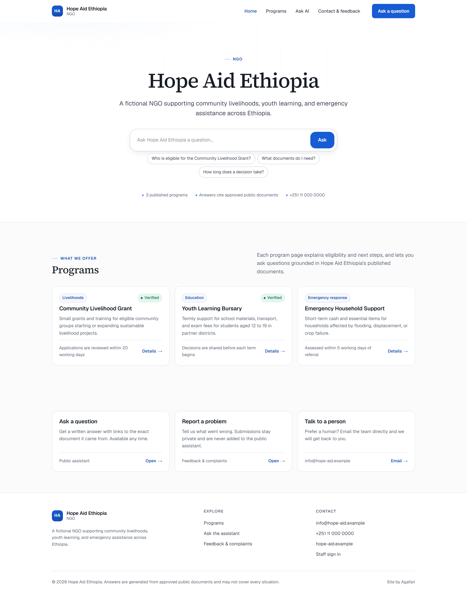
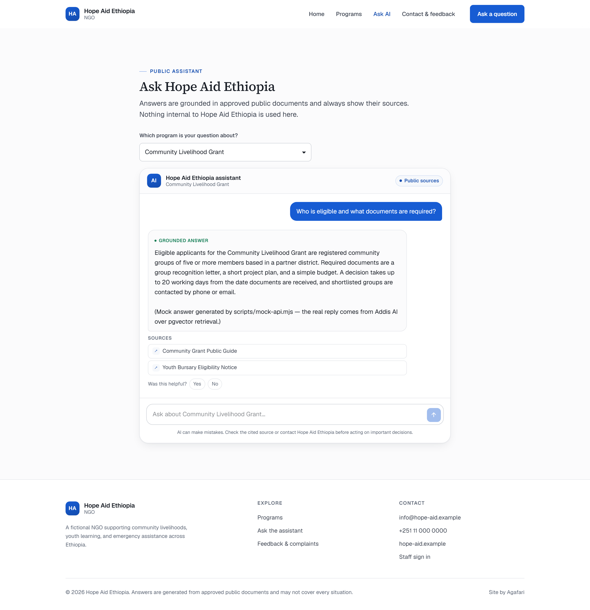
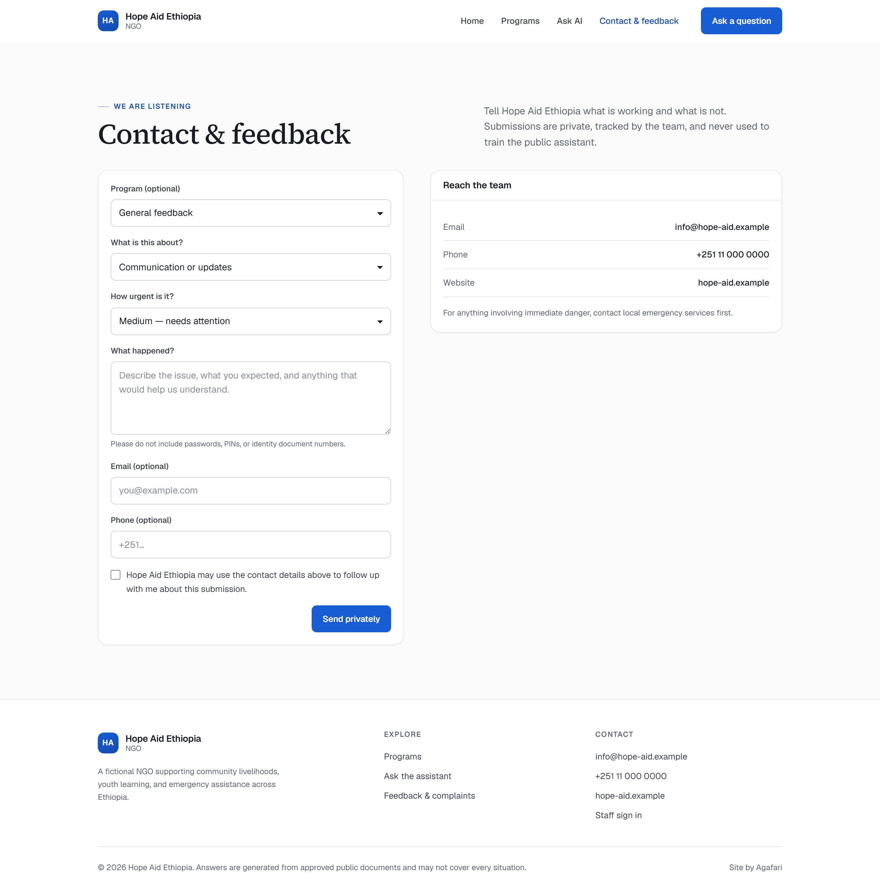
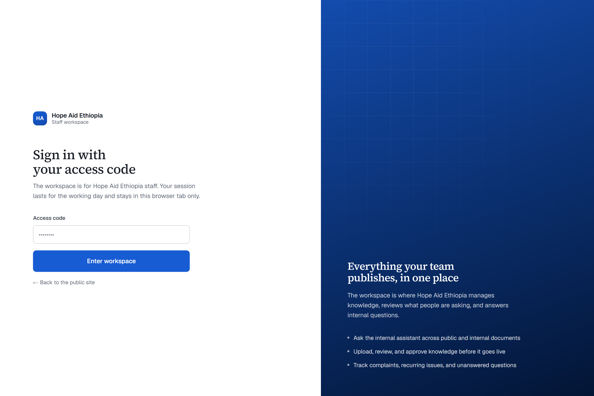
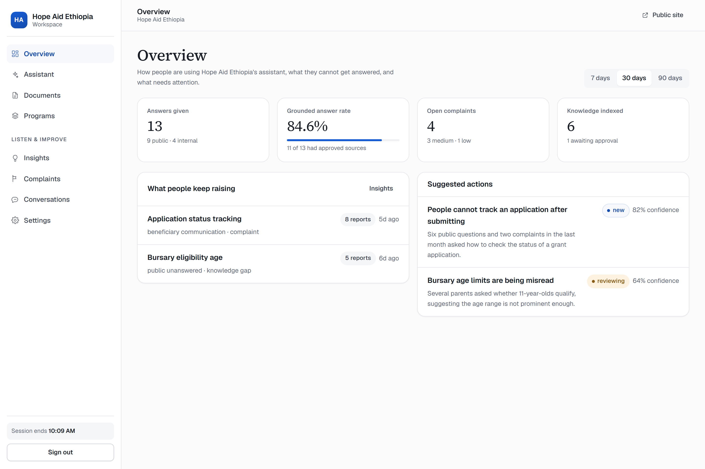
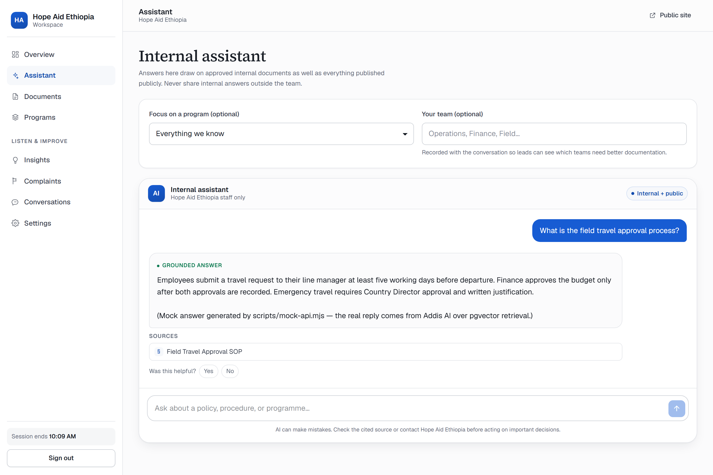
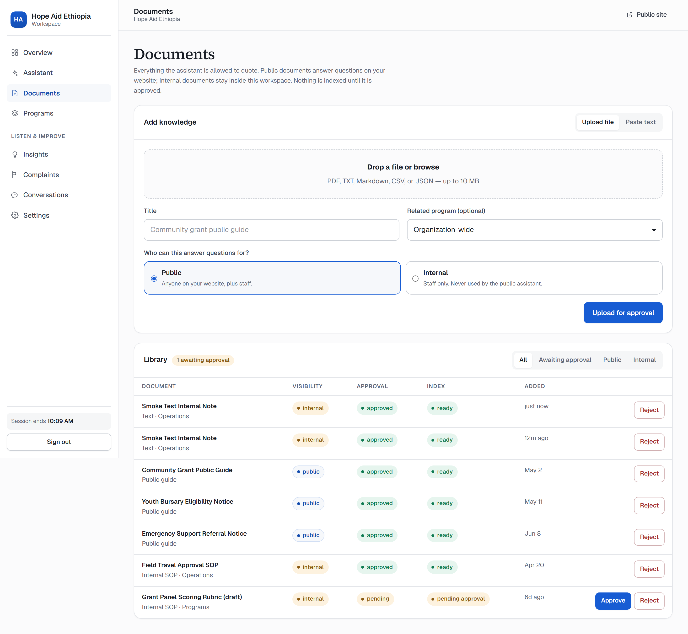
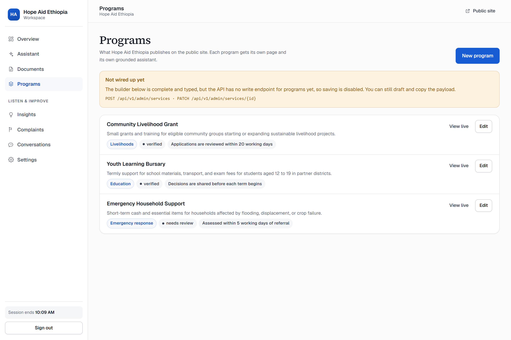

# Clarity — Agafari template v1

Clarity is one end-to-end template an organization gets when it signs up to
Agafari. It is two products behind one brand:

- a **public company site** for the people an organization serves, with a
  grounded assistant that only ever quotes approved public documents;
- a **private workspace** for staff, reached with an access code, with an
  internal assistant, a knowledge library, and the intelligence coming back
  from both audiences.

Everything visible — name, colours, wording, contact details, which features
exist at all — comes from the organization's bootstrap record. No copy in the
template is written for a specific tenant.

## Running it

```bash
# 1. API — either the real backend…
cd agafari-backend
alembic upgrade head && python seed_saas_demo.py
uvicorn app.main:app --reload --port 8000

# …or the mock, when you have no database or AI keys
cd agafari-frontend
npm run mock-api

# 2. The app
cd agafari-frontend
npm install
npm run dev
```

Then open `http://localhost:3000/sites/hope-aid`. The staff access code for the
seeded demo organization is `ngo-demo`.

`scripts/mock-api.mjs` serves the same endpoint contract with synthetic data
held in memory. Retrieval there is a keyword match rather than pgvector, but it
enforces the same visibility rule, so the isolation between public and internal
knowledge is real in both setups.

### Verifying a change

```bash
npm run lint
npx tsc --noEmit
npm run smoke        # walks the whole demo script and reports pass/fail
npm run screenshots  # refreshes docs/screenshots from a running app
```

`smoke` and `screenshots` expect a production server
(`npm run build && npx next start`), because Next's dev-mode client runtime does
not hydrate under the headless browser used here. Point them elsewhere with
`APP_URL` and `API_URL`.

## How a tenant is isolated

A tenant site never renders inside the Agafari marketing shell. It has its own
route tree, its own layout, its own stylesheet, and its own metadata.

| Concern | Where |
| --- | --- |
| Route tree | `src/app/sites/[slug]/**` — separate from `src/app/(marketing)` |
| Host routing | `src/proxy.ts` rewrites `hope-aid.agafari.com/*` to `/sites/hope-aid/*` |
| Link prefix | `x-clarity-base` header → `resolveBasePath()` → `SiteProvider` |
| Styling | `src/app/sites/clarity.css`, scoped under `.clarity`, every class `c-`-prefixed |
| Brand tokens | `buildBrandPalette()` writes CSS variables onto the tenant `<body>` |

Two addresses reach the same pages:

- `hope-aid.agafari.com/services` — production shape, clean URLs
- `localhost:3000/sites/hope-aid/services` — local demo shape

Components never hardcode either. They call `href("/services")` from
`useSite()`, or `joinPath(basePath, "/services")` on the server, and get the
right prefix for however the request arrived.

The only reference to Agafari on a tenant site is a single "Site by Agafari"
line in the footer.

## Public site

| Route | What it does |
| --- | --- |
| `/` | Brand hero with an ask box, featured programs, ways to get help |
| `/services` | Full catalogue with search and category filters |
| `/services/[slug]` | Detail, timeline, verification state, and a scoped assistant |
| `/ask` | The public assistant with a program selector |
| `/support` | Contact details and the complaint form |

The public assistant answers only from documents that are both `PUBLIC` and
`APPROVED`. Every answer carries its sources, and when retrieval finds nothing
the template says so and points to a human rather than inventing an answer.
Each answer can be marked helpful or not, which feeds the workspace insights.

Complaints are private: they are stored for staff, never indexed, and never
visible to the assistant. The form says this in plain words before someone
submits.

If `features.public_chat` or `features.complaints` is off, those routes render a
purposeful empty state — the contact route, an explanation — instead of a broken
page or a dead link. Navigation adapts too.

## Workspace

Reached at `/access`, which exchanges an access code for a token held in
`sessionStorage` for that tab only. `WorkspaceShell` guards every workspace
route, and a `401` from any call clears the session and returns the user to the
access screen.

| Route | What it does |
| --- | --- |
| `/workspace` | Answer volume, grounded answer rate, open complaints, indexed knowledge, top issues, suggested actions |
| `/workspace/assistant` | Internal assistant over public **and** internal approved documents, scoped by program and team |
| `/workspace/documents` | Upload a file or paste text, choose visibility, approve or reject; nothing is indexed before approval |
| `/workspace/services` | Full builder for programs — drafting works, saving waits on the API (see below) |
| `/workspace/insights` | Recurring gaps with a recommendation, owner, status, and note |
| `/workspace/complaints` | Filter by status and severity, record what was done |
| `/workspace/conversations` | Recent public and internal exchanges with their citations and feedback |
| `/workspace/settings` | Read-only preview of the branding, wording, features, and contacts driving the site |

### Dual RAG

The separation is a data rule, not a prompt:

| Assistant | Sees |
| --- | --- |
| Public | `visibility = PUBLIC` **and** `approval_status = APPROVED` |
| Internal | `PUBLIC` + `INTERNAL`, both still requiring `APPROVED` |

`node scripts/smoke.mjs` asserts this end to end: it uploads an internal
document, approves it, then asks the public assistant about its contents and
fails if the document is cited.

## Where the API stops

Two screens are complete in the UI but have no endpoint to call. Rather than
fake a save, they disable it and name the missing route:

| Screen | Missing endpoint | Behaviour |
| --- | --- | --- |
| Programs builder | `POST /api/v1/admin/services`, `PATCH /api/v1/admin/services/{id}` | Full form, validation, and a "copy draft" action; save disabled |
| Settings | `PATCH /api/v1/organizations/{slug}` | Live configuration shown read-only |

When those routes ship, flip `SERVICE_WRITE_API` / `ORGANIZATION_SETTINGS_API`
in `src/lib/clarity/client.ts` and the same screens become live.

## Customization

Everything below is read from `GET /api/v1/organizations/{slug}/bootstrap`:

- **Identity** — name, short code, sector, description, logo (initials when no
  logo is set)
- **Colour** — `theme.primary` and `theme.accent` are expanded into a full ramp
  by `buildBrandPalette()`, which darkens a primary that would fail WCAG AA
  against white rather than shipping unreadable buttons
- **Wording** — `terminology.service_singular` / `service_plural` replace the
  word "service" in navigation, headings, forms, and assistant copy. The demo
  NGO says "Programs"
- **Contacts** — surfaced in the footer, the support page, and the unanswered-
  question fallback
- **Features** — `public_chat`, `complaints`, `employee_assistant`, `insights`
  each add or remove routes, navigation, and calls to action

Adding a tenant means adding a bootstrap record. No template changes.

## Design

The visual system is deliberately quiet: a serif display face
(Source Serif 4) for headings against the UI sans, generous whitespace, one
accent colour doing the work of drawing attention, and cards that use a hairline
border plus a low-contrast shadow rather than heavy chrome. Motion is limited to
short entrances and state changes, and is dropped entirely under
`prefers-reduced-motion`.

Accessibility: semantic landmarks, labelled form fields, `aria-current` on the
active navigation item, live regions for streaming answers, visible focus rings,
and a contrast floor enforced in code by the palette builder.

Mobile: the public site collapses to a single column with a disclosure menu, and
the workspace keeps its sidebar behind a toggle with a scrim. Chat composers stay
reachable, and tables scroll horizontally inside their panel instead of breaking
the layout.

## Demo script

Screenshots for each step are in `agafari-frontend/docs/screenshots`, produced by
`scripts/screenshots.mjs`.

1. **Public site** — open the tenant home, browse programs, open a program.
   
2. **Ask publicly** — ask about eligibility and see the answer with its source.
   
3. **Feedback and complaint** — mark an answer helpful, then submit a complaint
   from the support page.
   
4. **Sign in** — enter the access code at `/access`.
   
5. **Workspace overview** — see the volume, answer rate, and what people keep
   raising.
   
6. **Internal assistant** — ask something only an internal SOP answers, and see
   it cited.
   
7. **Documents** — upload a document as internal, approve it, watch it index.
   
8. **Isolation** — return to the public assistant and confirm it will not quote
   that document.
9. **Programs builder** — open the builder and see the honest API gap.
   
10. **Sign out** — the session is revoked and the workspace is unreachable.

## Layout of the code

```
src/
  proxy.ts                       host → tenant rewrite
  app/sites/clarity.css          the template's design system
  app/sites/[slug]/
    layout.tsx                   bootstrap fetch, brand tokens, fonts, context
    (site)/                      public pages, header + footer
    access/                      access-code sign in
    workspace/                   guarded staff pages
  components/clarity/            template components, all c- prefixed markup
  lib/clarity/
    brand.ts                     palette generation and contrast
    client.ts                    authenticated API client
    session.ts                   sessionStorage-backed access session
    href.ts                      base-path aware link building
    use-async.ts                 shared load/error/empty behaviour
```
